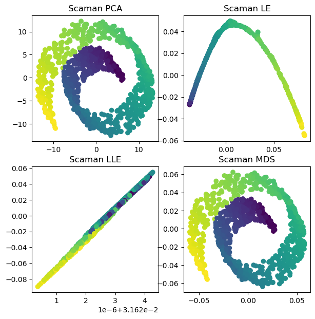

# scaman
Scalable Manifold Library for High Dimensional Data
=======
# Scaman

Scaman is a comprehensive Python package focused on manifold learning and dimensionality reduction. It is designed to facilitate the analysis and visualization of high-dimensional data using a variety of advanced algorithms.



## Features

- **Robust Algorithms**: Implements popular manifold learning algorithms such as PCA, MDS, LE, and LLE for effective dimensionality reduction.
- **Eigensolver Integration**: Incorporates different eigensolvers like FEAST, NumPy, SciPy, and SLEPc, allowing for versatile eigenvalue problem solutions.
- **Serial and Parallel Processing**: Supports both serial and parallel processing to accommodate different computational needs.
- **Utility Tools**: Provides additional tools for intrinsic dimension estimation, data conversion, FLANN library for faster neighbor matrix creation ,and more.

## Algorithms

### PCA (Principal Component Analysis)
PCA is a fundamental technique for dimensionality reduction, focusing on capturing the most variance in the data.

### LE (Laplacian Eigenmaps)
LE is effective for nonlinear dimensionality reduction, preserving local neighborhood information.

### LLE (Locally Linear Embedding)
LLE works well for unfolding twisted or curved manifolds by preserving local distances.

### MDS (Multidimensional Scaling)
MDS seeks to preserve the global distances between data points in the lower-dimensional space.

## Eigensolvers

- **FEAST Eigensolver**: Efficient for large-scale problems, particularly when a specific interval of eigenvalues is required.
- **NumPy Eigensolver**: A general-purpose solver, suitable for smaller datasets.
- **SciPy Eigensolver**: Offers more options and flexibility compared to NumPy, useful for medium-sized problems.
- **SLEPc Eigensolver**: Ideal for large-scale problems, providing high performance in parallel environments.

## Installation

Ensure the following packages are installed:

- NumPy
- SciPy
- Matplotlib
- Scikit-learn
- Networkx
- FLANN (pyflann)
- SLEPc4py
- PETSc4py 
- MPI4Py (for parallel processing)

Install Scaman using pip:

```bash
pip install scaman
```
Example Usage

PCA with NumPy Eigensolver
```bash
from serial.pca import PCA
pca = PCA(n_components=2, eig_method='numpy')
embedding_pca = pca.fit_transform(data)
```
LE with SLEPc Eigensolver
```bash
from serial.le import LE
le = LE(data, n_components=6, k=7, solver='slepc', sigma=1, normalize=False)
embedding_le = le.fit_transform()
```
Funding
This project is funded by TÜBİTAK under the code XXXXX, promoting advanced research in manifold learning and data science.

